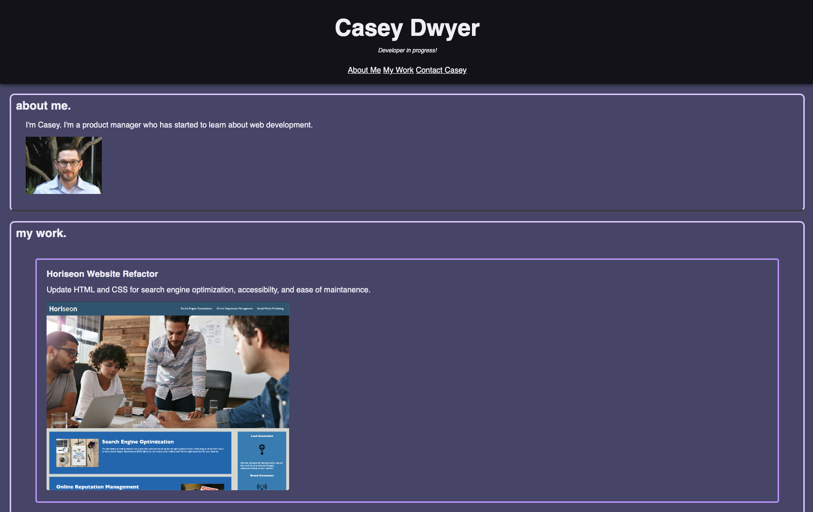

# Caseys-Portfolio

## Description

Create a portfolio to document and showcase my work as I learn more about web development. The goal for this portfolio in it's current state is to create a responsive design. As my skills progress, so shall the quality of the portfolio and the projects linked therein.

## Usage

Navigate to the website on Github Pages.

## Credits

MDN web docs for [HTML](https://developer.mozilla.org/en-US/docs/Web/HTML) and [CSS](https://developer.mozilla.org/en-US/docs/Web/CSS)

## License

N/A
